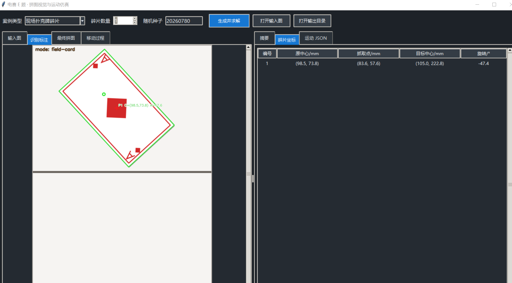

# 2026电赛开源清单

交流群:947328620

## H 题
【【26电赛】26年电赛H题车载平衡滚球运动控制系统思路初分析】 https://www.bilibili.com/video/BV1HE3k6nETU/?share_source=copy_web&vd_source=239a4bb1b519298a266ee42524ef6a15

### 曲柄连杆机构
【【26电赛】开源！！！26年电赛H题车载平衡滚球运动控制系统机械部分开源，打印教程】 https://www.bilibili.com/video/BV1wp3y6xEue/?share_source=copy_web&vd_source=239a4bb1b519298a266ee42524ef6a15

曲柄的文件在 H题\曲柄文件\钢球平衡机构.rar 里面

### 循迹示例算法

【【26电赛】26年电赛H题【寻迹缓启缓停】车载平衡滚球运动控制系统】 https://www.bilibili.com/video/BV1tt3C6AECv/?share_source=copy_web&vd_source=239a4bb1b519298a266ee42524ef6a15

循迹视频的示例算法可以在这里看
H题\循迹示例算法\Get_Line.c
通用性比较广
底盘运动的代码在  H题\小车循迹底盘开源代码

### 图传方案

#### MaixCam2版
【【26电赛】开源! ! ! H题图传【maixcam2版本】26年电赛H题图传方案】 https://www.bilibili.com/video/BV1ac3y66EAP/?share_source=copy_web&vd_source=239a4bb1b519298a266ee42524ef6a15

直接把  H题\图传\maixcam2源码\image_transmission.py   放到MaixVision中即可使用
使用之前先让 maixcam2 和 电脑连接在同一个局域网中

#### EspCam版

##### 上位机版
【【26电赛】开源! ! ! 【 ESPCam图传上位机】H题图传26年电赛H题图传方案】 https://www.bilibili.com/video/BV1zM3169EzY/?share_source=copy_web&vd_source=239a4bb1b519298a266ee42524ef6a15

上位机版本只需要打开
H题\图传\espcam_上位机版\ESP32_CAM_Desktop(1).exe 中的exe文件
exe电脑打开即可， 然后使用 bin 文件进行espcam 固件的烧录，烧录完成以后按照视频连接配网即可使用。
bin文件源码在  H题\图传\espcam_上位机版\esp32bin文件源码 查看
上位机源码在  H题\图传\espcam_上位机版\上位机源码\camera_desktop_app.py 查看
*** 抛砖引玉,推荐大家修改源码，以增加比赛测试环境下的稳定性 ***

##### 源码版
【【26电赛】开源! ! ! H题图传26年电赛H题图传方案 ESPCam版】 https://www.bilibili.com/video/BV1mD3y6KEY6/?share_source=copy_web&vd_source=239a4bb1b519298a266ee42524ef6a15

代码都在
H题\图传\espcam_源码
这个需要使用espidf 进行编译下载。
使用说明 在 H题\图传\espcam_源码\espcam源码版使用说明.md

上位机版和烧录的bin文件即将开源

## E题
【【26电赛】开源! ! ! E题拼图设备【上位机版】26年电赛E题扑克识别】 https://www.bilibili.com/video/BV1kw316ZEYC/?share_source=copy_web&vd_source=239a4bb1b519298a266ee42524ef6a15

E题 拼图设备纯白+扑克自动识别于运动仿真 开源代码详见

E题\电赛E题代码

## C题
【【26电赛】开源! ! ! 26年电赛C题 上位机直接秒了！！！】 https://www.bilibili.com/video/BV1p33b6mE3W/?share_source=copy_web&vd_source=239a4bb1b519298a266ee42524ef6a15
 **（抛砖引玉大家可以自行修改上位机代码）** 
源码在  C题\开源源码  中进行查看
需要自己先配置好基站和标签，然后把基站USB口直接连到上位机 先在配置页面搜索出标签并保存。
这样比赛现场就不会因为有其他标签干扰位置和角度定位 。

【【26电赛】26年电赛C题分析（低成本方案！！！）】 https://www.bilibili.com/video/BV1Yd3r6KEzv/?share_source=copy_web&vd_source=239a4bb1b519298a266ee42524ef6a15

C题选用 爱信可 BU04 模块

## 交流群

